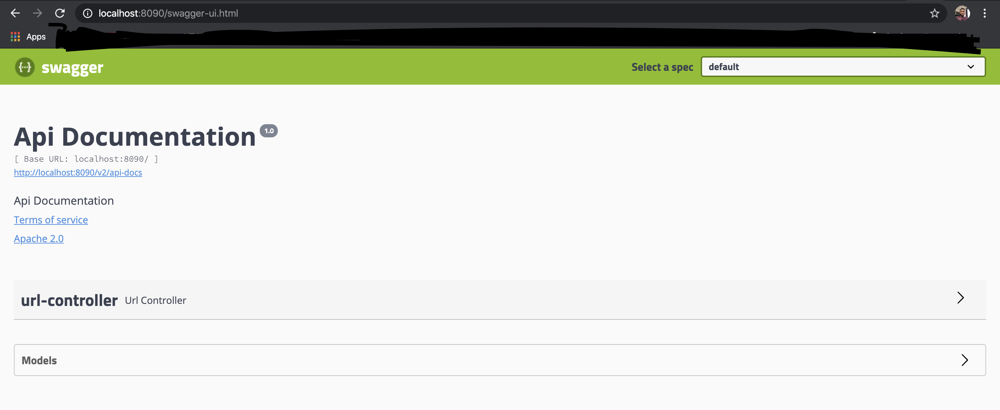

#Url-Shortner
This is a url shortner service that takes in long url input from the user and generates a short url.

This service is integrated with swagger-ui which allows for easy testing of all the end-points and describes all required arguments to test the end-points. 

To access the swagger-ui view of this service, the url format - "\<host:port\>/swagger-ui.html" should be used where host is the ip address of the system running the service which more often than not will be localhost and the port is 8090 which can be reconfigured. 

Attached below is an image to this effect.

